# 20 张架构图

本目录保存 2026-09-20 汇总后的目标架构设计：Mermaid 源码、图片索引和说明文档。它描述目标设计，不等同于当前代码已经全部实现、真实账号能力已经验证或已经完成生产部署。

## 快速索引

`images/` 包含 20 张 PNG 和 20 张 SVG。PNG 适合直接查看，SVG 可无损放大；`sources/` 保存每张图对应的可编辑 Mermaid 源码。

| 编号 | 标题 | PNG | SVG | Mermaid 源码 |
|---:|---|---|---|---|
| 01 | 系统总架构 | [PNG](images/01-system-overview.png) | [SVG](images/01-system-overview.svg) | [MMD](sources/01-system-overview.mmd) |
| 02 | 模型判断与流程执行的边界 | [PNG](images/02-model-execution-boundary.png) | [SVG](images/02-model-execution-boundary.svg) | [MMD](sources/02-model-execution-boundary.mmd) |
| 03 | 固定流程库与版本管理架构 | [PNG](images/03-flow-registry-versioning.png) | [SVG](images/03-flow-registry-versioning.svg) | [MMD](sources/03-flow-registry-versioning.mmd) |
| 04 | Linux 授权端内部架构 | [PNG](images/04-linux-authorization.png) | [SVG](images/04-linux-authorization.svg) | [MMD](sources/04-linux-authorization.mmd) |
| 05 | 账密分发、授权到期与续期恢复 | [PNG](images/05-auth-expiry-renewal.png) | [SVG](images/05-auth-expiry-renewal.svg) | [MMD](sources/05-auth-expiry-renewal.mmd) |
| 06 | 积分与任务预算结算架构 | [PNG](images/06-credit-settlement.png) | [SVG](images/06-credit-settlement.svg) | [MMD](sources/06-credit-settlement.mmd) |
| 07 | 客户端操作面板架构 | [PNG](images/07-client-workbench.png) | [SVG](images/07-client-workbench.svg) | [MMD](sources/07-client-workbench.mmd) |
| 08 | Agent 聊天、执行与结果判断时序 | [PNG](images/08-chat-execution-sequence.png) | [SVG](images/08-chat-execution-sequence.svg) | [MMD](sources/08-chat-execution-sequence.mmd) |
| 09 | 向量知识库与执行前话术准备 | [PNG](images/09-knowledge-talk-preparation.png) | [SVG](images/09-knowledge-talk-preparation.svg) | [MMD](sources/09-knowledge-talk-preparation.mmd) |
| 10 | 找视频固定流程 | [PNG](images/10-video-search-flow.png) | [SVG](images/10-video-search-flow.svg) | [MMD](sources/10-video-search-flow.mmd) |
| 11 | 评论区完整业务架构 | [PNG](images/11-comment-area-business.png) | [SVG](images/11-comment-area-business.svg) | [MMD](sources/11-comment-area-business.mmd) |
| 12 | 直播间完整业务架构 | [PNG](images/12-live-room-business.png) | [SVG](images/12-live-room-business.svg) | [MMD](sources/12-live-room-business.mmd) |
| 13 | 跨板块业务组合架构 | [PNG](images/13-cross-module-composition.png) | [SVG](images/13-cross-module-composition.svg) | [MMD](sources/13-cross-module-composition.mmd) |
| 14 | 多账号并行执行架构 | [PNG](images/14-multi-account-parallel.png) | [SVG](images/14-multi-account-parallel.svg) | [MMD](sources/14-multi-account-parallel.mmd) |
| 15 | 单轮固定流程的生命周期 | [PNG](images/15-run-lifecycle.png) | [SVG](images/15-run-lifecycle.svg) | [MMD](sources/15-run-lifecycle.mmd) |
| 16 | 异常重试、固化与人工后自动恢复 | [PNG](images/16-retry-recovery.png) | [SVG](images/16-retry-recovery.svg) | [MMD](sources/16-retry-recovery.mmd) |
| 17 | 双渠道动作账本与防重复发送 | [PNG](images/17-action-ledger-idempotency.png) | [SVG](images/17-action-ledger-idempotency.svg) | [MMD](sources/17-action-ledger-idempotency.mmd) |
| 18 | 平台与协作者的开发边界 | [PNG](images/18-platform-collaborator-boundary.png) | [SVG](images/18-platform-collaborator-boundary.svg) | [MMD](sources/18-platform-collaborator-boundary.mmd) |
| 19 | 核心数据与状态归属 | [PNG](images/19-data-state-ownership.png) | [SVG](images/19-data-state-ownership.svg) | [MMD](sources/19-data-state-ownership.mmd) |
| 20 | 部署、分发与升级架构 | [PNG](images/20-deployment-upgrade.png) | [SVG](images/20-deployment-upgrade.svg) | [MMD](sources/20-deployment-upgrade.mmd) |

## PNG 预览

### 01．系统总架构

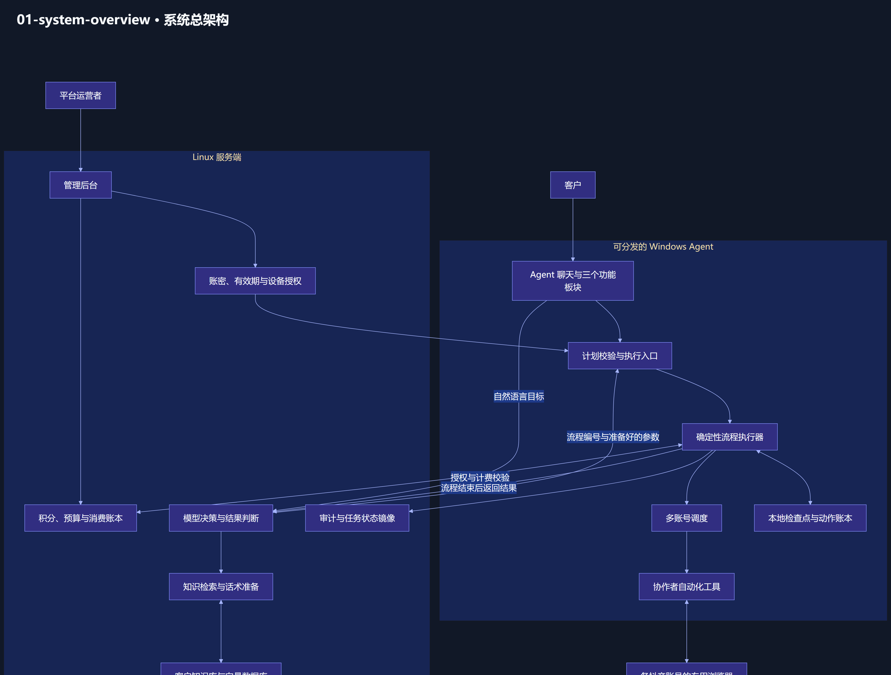

### 02．模型判断与流程执行的边界

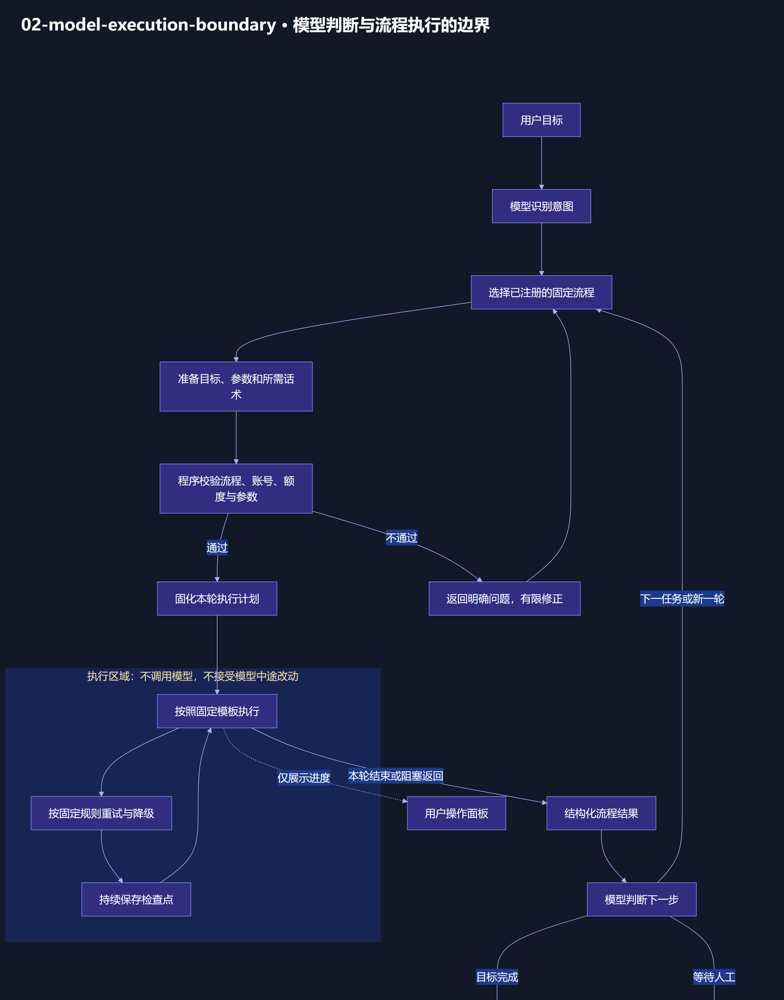

### 03．固定流程库与版本管理架构

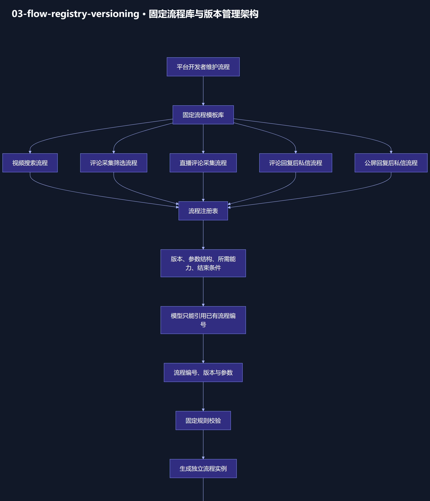

### 04．Linux 授权端内部架构

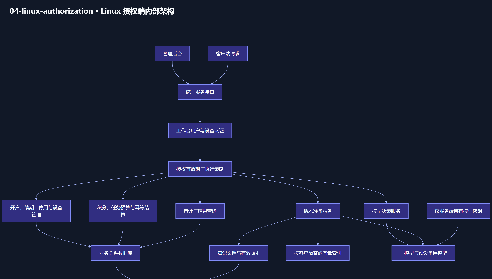

### 05．账密分发、授权到期与续期恢复

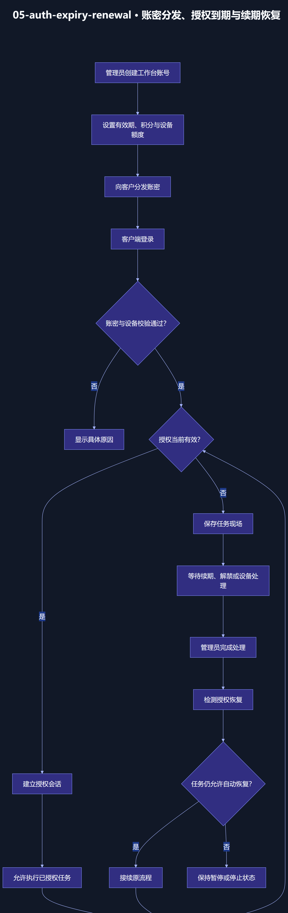

### 06．积分与任务预算结算架构

### 07．客户端操作面板架构

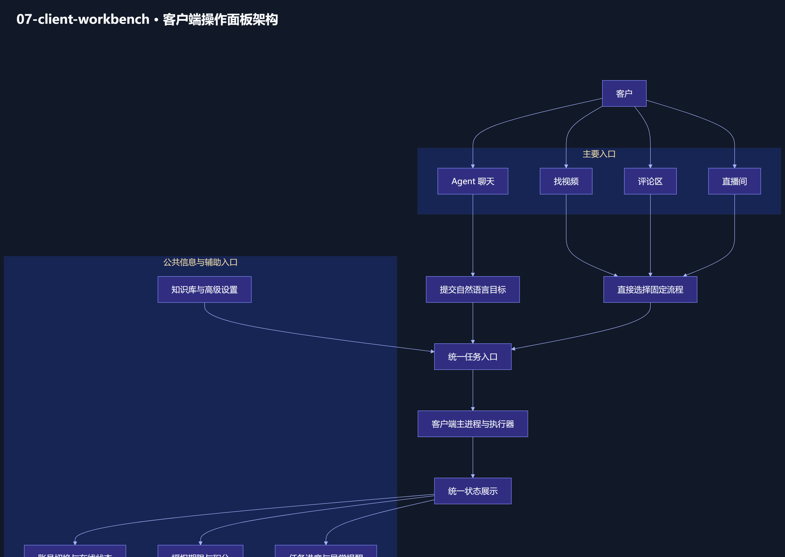

### 08．Agent 聊天、执行与结果判断时序

### 09．向量知识库与执行前话术准备

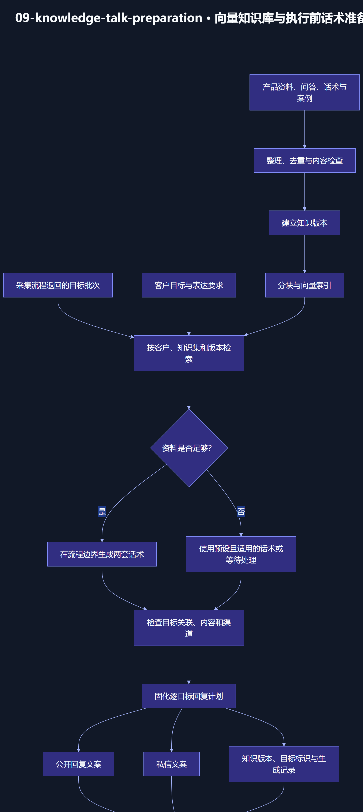

### 10．找视频固定流程

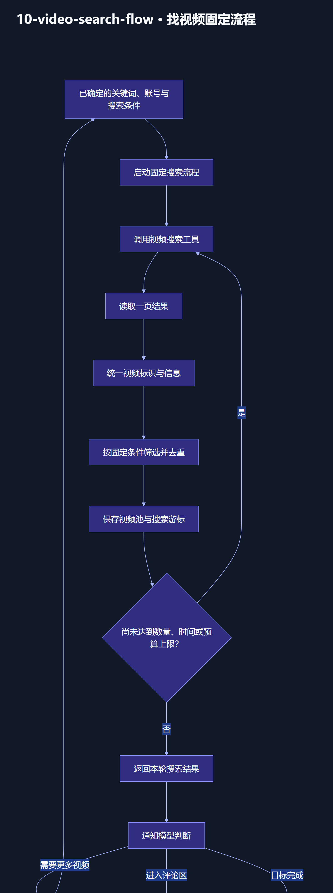

### 11．评论区完整业务架构

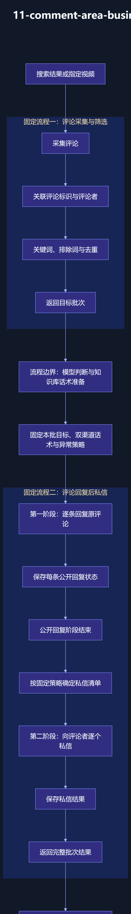

### 12．直播间完整业务架构

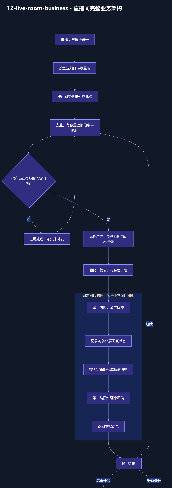

### 13．跨板块业务组合架构

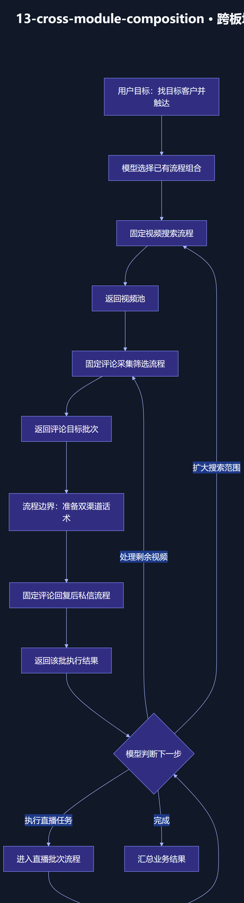

### 14．多账号并行执行架构

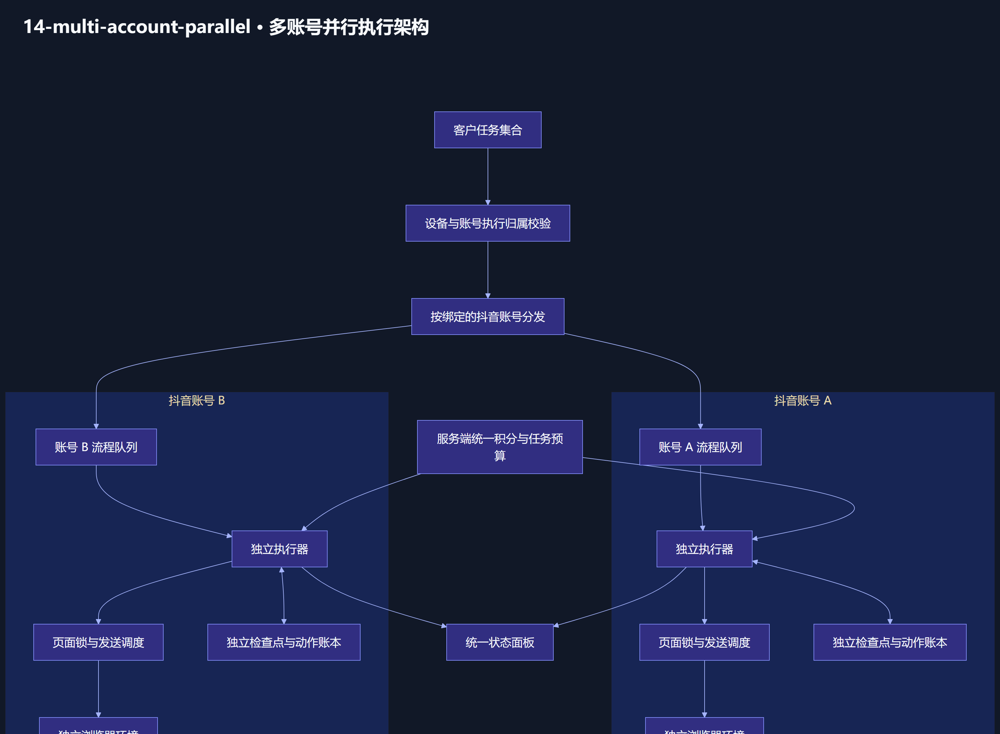

### 15．单轮固定流程的生命周期

### 16．异常重试、固化与人工后自动恢复

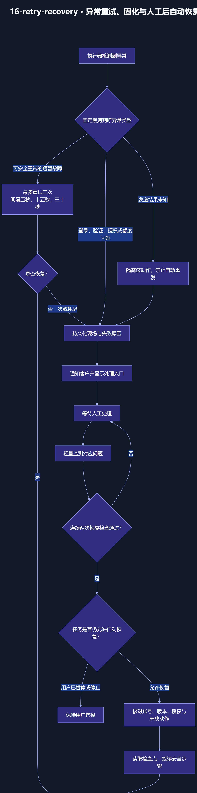

### 17．双渠道动作账本与防重复发送

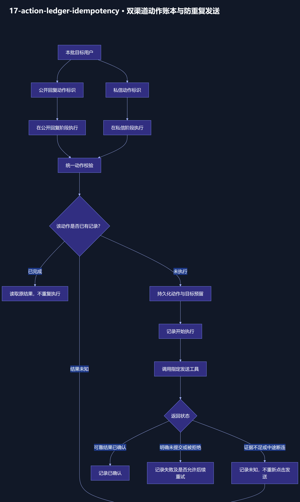

### 18．平台与协作者的开发边界

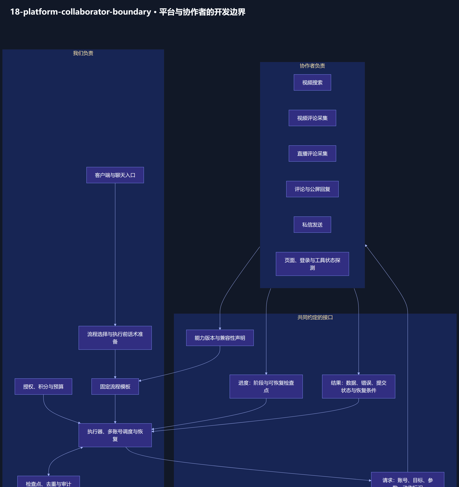

### 19．核心数据与状态归属

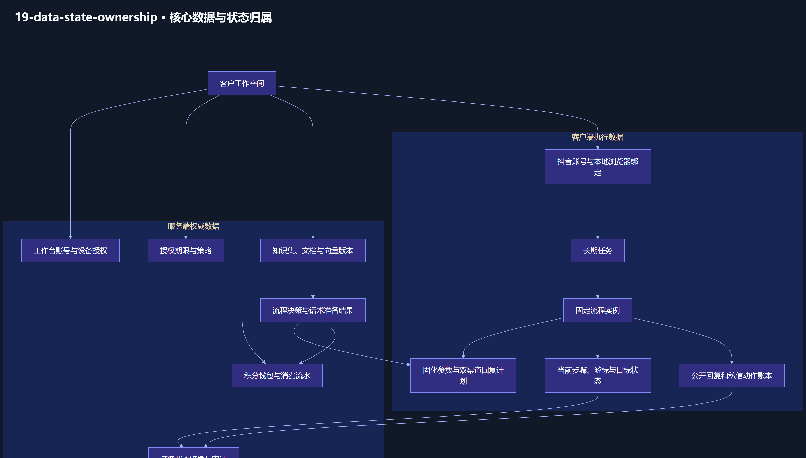

### 20．部署、分发与升级架构

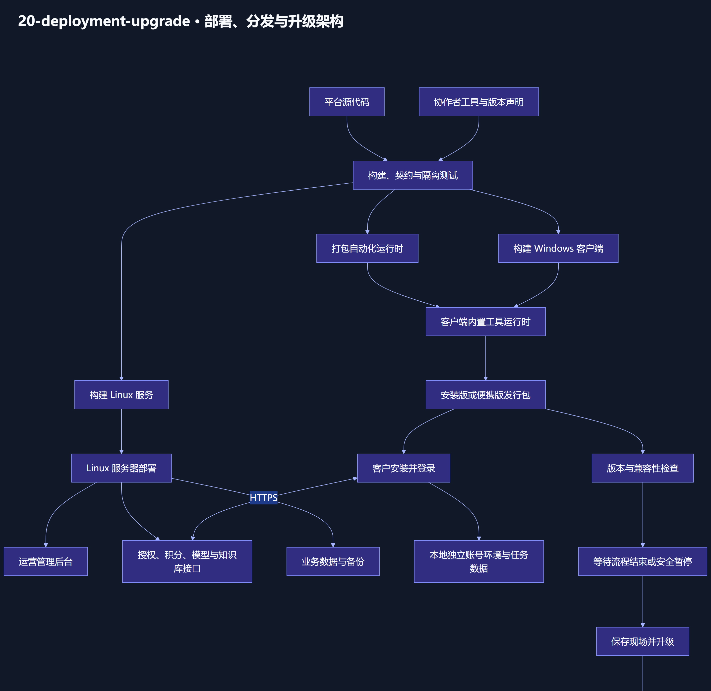

完整 Mermaid 图和每张图的必要说明见 [architecture.md](architecture.md)。机器可读索引见 [manifest.json](manifest.json)。
