# 抖音截流 Agent：20 张完整架构图

这组图整理自 2026-09-20 的目标设计。它描述目标架构与边界，不表示现有代码、平台资质、真实账号能力或生产部署已经全部完成。

核心规则：模型在流程开始前做判断和准备；执行器独立执行；流程返回后，模型再判断下一步。固定流程运行期间不调用模型，也不接受模型中途改动；流程结束、失败终止或固化等待人工后，才返回结构化结果。

## 01．系统总架构

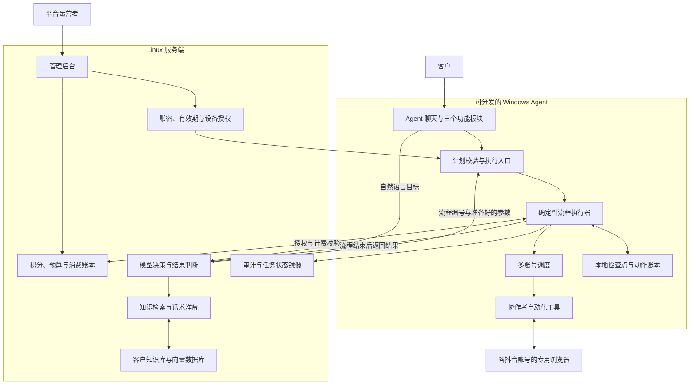
```mermaid
flowchart TB
    User["客户"]
    Admin["平台运营者"]

    subgraph Linux["Linux 服务端"]
        Console["管理后台"]
        Auth["账密、有效期与设备授权"]
        Credits["积分、预算与消费账本"]
        Decision["模型决策与结果判断"]
        Preparation["知识检索与话术准备"]
        Knowledge["客户知识库与向量数据库"]
        Audit["审计与任务状态镜像"]

        Console --> Auth
        Console --> Credits
        Decision --> Preparation
        Preparation <--> Knowledge
    end

    subgraph Windows["可分发的 Windows Agent"]
        UI["Agent 聊天与三个功能板块"]
        Gate["计划校验与执行入口"]
        Engine["确定性流程执行器"]
        Accounts["多账号调度"]
        Store["本地检查点与动作账本"]
        Tools["协作者自动化工具"]

        UI --> Gate
        Gate --> Engine
        Engine --> Accounts
        Accounts --> Tools
        Engine <--> Store
    end

    User --> UI
    Admin --> Console

    UI -->|自然语言目标| Decision
    Decision -->|流程编号与准备好的参数| Gate
    Engine -->|流程结束后返回结果| Decision

    Auth --> Gate
    Engine <-->|授权与计费校验| Credits
    Engine --> Audit
    Tools <--> Browser["各抖音账号的专用浏览器"]
```

Linux 服务端负责授权、积分、知识库、模型决策和审计；Windows Agent 负责客户端界面、固定流程执行、多账号调度和本地检查点。

源码：[01-system-overview.mmd](sources/01-system-overview.mmd)

## 02．模型判断与流程执行的边界

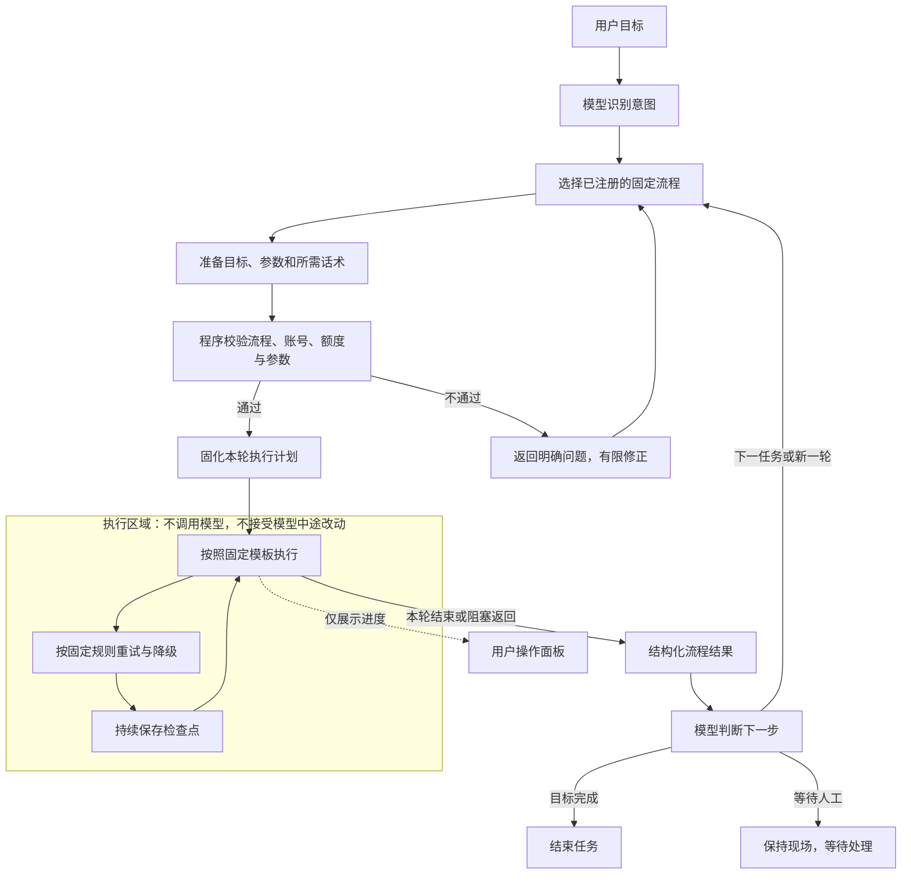
```mermaid
flowchart TD
    Goal["用户目标"]
    Understand["模型识别意图"]
    Select["选择已注册的固定流程"]
    Prepare["准备目标、参数和所需话术"]
    Validate["程序校验流程、账号、额度与参数"]
    Freeze["固化本轮执行计划"]

    Goal --> Understand --> Select --> Prepare --> Validate
    Validate -->|通过| Freeze
    Validate -->|不通过| Correct["返回明确问题，有限修正"]
    Correct --> Select

    subgraph Execution["执行区域：不调用模型，不接受模型中途改动"]
        Run["按照固定模板执行"]
        Rules["按固定规则重试与降级"]
        Save["持续保存检查点"]

        Run --> Rules
        Rules --> Save
        Save --> Run
    end

    Freeze --> Run
    Run -->|本轮结束或阻塞返回| Result["结构化流程结果"]
    Result --> Judge["模型判断下一步"]

    Judge -->|下一任务或新一轮| Select
    Judge -->|目标完成| Done["结束任务"]
    Judge -->|等待人工| Human["保持现场，等待处理"]

    Run -.->|仅展示进度| Panel["用户操作面板"]
```

运行中的目标、话术和步骤保持固定；授权有效性、任务是否被用户停止等事实仍由程序持续检查。

源码：[02-model-execution-boundary.mmd](sources/02-model-execution-boundary.mmd)

## 03．固定流程库与版本管理架构

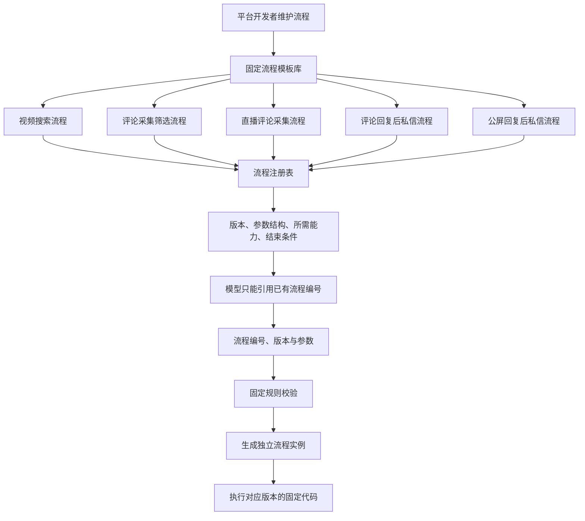
```mermaid
flowchart TB
    Developer["平台开发者维护流程"]
    Templates["固定流程模板库"]

    Developer --> Templates

    Templates --> Search["视频搜索流程"]
    Templates --> CommentCollect["评论采集筛选流程"]
    Templates --> LiveCollect["直播评论采集流程"]
    Templates --> CommentReply["评论回复后私信流程"]
    Templates --> LiveReply["公屏回复后私信流程"]

    Search --> Registry["流程注册表"]
    CommentCollect --> Registry
    LiveCollect --> Registry
    CommentReply --> Registry
    LiveReply --> Registry

    Registry --> Contract["版本、参数结构、所需能力、结束条件"]
    Contract --> Model["模型只能引用已有流程编号"]
    Model --> Request["流程编号、版本与参数"]
    Request --> Validator["固定规则校验"]
    Validator --> Instance["生成独立流程实例"]
    Instance --> Executor["执行对应版本的固定代码"]
```

模型只能选择注册流程；流程升级只影响符合升级条件的新实例。

源码：[03-flow-registry-versioning.mmd](sources/03-flow-registry-versioning.mmd)

## 04．Linux 授权端内部架构

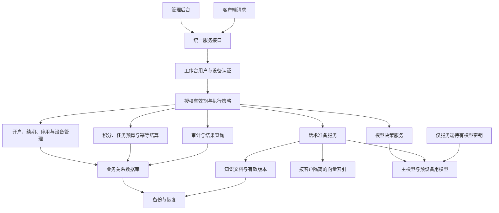
```mermaid
flowchart TB
    Admin["管理后台"]
    Client["客户端请求"]

    Admin --> API["统一服务接口"]
    Client --> API

    API --> Identity["工作台用户与设备认证"]
    Identity --> Policy["授权有效期与执行策略"]

    Policy --> Accounts["开户、续期、停用与设备管理"]
    Policy --> Billing["积分、任务预算与幂等结算"]
    Policy --> Decision["模型决策服务"]
    Policy --> Content["话术准备服务"]
    Policy --> Events["审计与结果查询"]

    Accounts --> DB["业务关系数据库"]
    Billing --> DB
    Events --> DB

    Content --> Knowledge["知识文档与有效版本"]
    Content --> Vector["按客户隔离的向量索引"]
    Decision --> Models["主模型与预设备用模型"]
    Content --> Models

    Secrets["仅服务端持有模型密钥"] --> Models
    DB --> Backup["备份与恢复"]
    Knowledge --> Backup
```

初期可将这些逻辑模块部署为一个服务端应用；服务端是授权、积分、策略和审计的唯一权威。

源码：[04-linux-authorization.mmd](sources/04-linux-authorization.mmd)

## 05．账密分发、授权到期与续期恢复

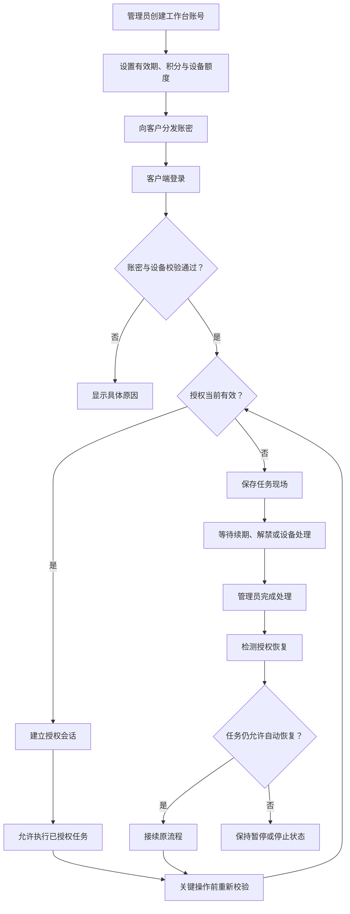
```mermaid
flowchart TD
    Create["管理员创建工作台账号"]
    Configure["设置有效期、积分与设备额度"]
    Distribute["向客户分发账密"]
    Login["客户端登录"]

    Create --> Configure --> Distribute --> Login

    Login --> Check{"账密与设备校验通过？"}
    Check -->|否| Error["显示具体原因"]
    Check -->|是| Valid{"授权当前有效？"}

    Valid -->|是| Session["建立授权会话"]
    Session --> Tasks["允许执行已授权任务"]
    Tasks --> Verify["关键操作前重新校验"]
    Verify --> Valid

    Valid -->|否| Save["保存任务现场"]
    Save --> Wait["等待续期、解禁或设备处理"]
    Wait --> Change["管理员完成处理"]
    Change --> Detect["检测授权恢复"]

    Detect --> Ready{"任务仍允许自动恢复？"}
    Ready -->|是| Resume["接续原流程"]
    Ready -->|否| Remain["保持暂停或停止状态"]

    Resume --> Verify
```

工作台账密由授权端管理；抖音账号在客户自己的专用浏览器中登录，两套账户分开。

源码：[05-auth-expiry-renewal.mmd](sources/05-auth-expiry-renewal.mmd)

## 06．积分与任务预算结算架构

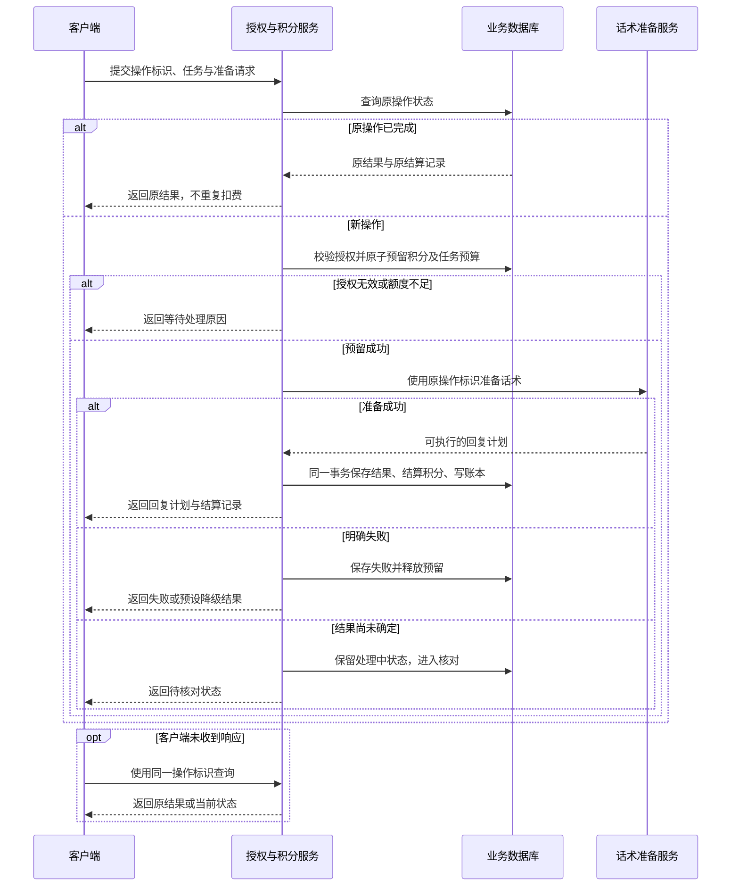
```mermaid
sequenceDiagram
    participant C as 客户端
    participant S as 授权与积分服务
    participant D as 业务数据库
    participant P as 话术准备服务

    C->>S: 提交操作标识、任务与准备请求
    S->>D: 查询原操作状态

    alt 原操作已完成
        D-->>S: 原结果与原结算记录
        S-->>C: 返回原结果，不重复扣费
    else 新操作
        S->>D: 校验授权并原子预留积分及任务预算

        alt 授权无效或额度不足
            S-->>C: 返回等待处理原因
        else 预留成功
            S->>P: 使用原操作标识准备话术

            alt 准备成功
                P-->>S: 可执行的回复计划
                S->>D: 同一事务保存结果、结算积分、写账本
                S-->>C: 返回回复计划与结算记录
            else 明确失败
                S->>D: 保存失败并释放预留
                S-->>C: 返回失败或预设降级结果
            else 结果尚未确定
                S->>D: 保留处理中状态，进入核对
                S-->>C: 返回待核对状态
            end
        end
    end

    opt 客户端未收到响应
        C->>S: 使用同一操作标识查询
        S-->>C: 返回原结果或当前状态
    end
```

以一批回复的话术准备服务为例：已付费生成的回复不重复收费；发送结果与生成消费分别记录。

源码：[06-credit-settlement.mmd](sources/06-credit-settlement.mmd)

## 07．客户端操作面板架构

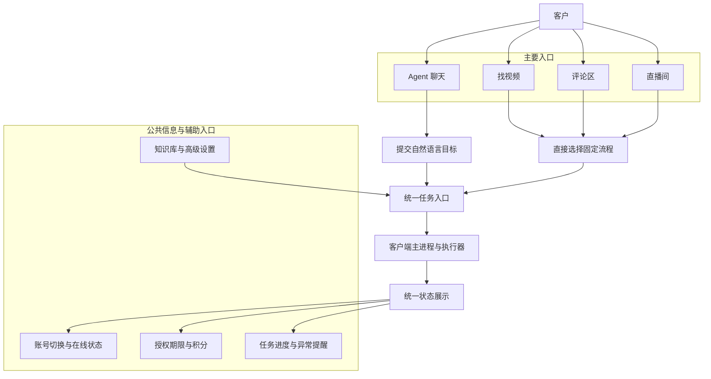
```mermaid
flowchart TB
    User["客户"]

    subgraph Main["主要入口"]
        Chat["Agent 聊天"]
        Video["找视频"]
        Comment["评论区"]
        Live["直播间"]
    end

    subgraph Common["公共信息与辅助入口"]
        Accounts["账号切换与在线状态"]
        Credits["授权期限与积分"]
        Tasks["任务进度与异常提醒"]
        Settings["知识库与高级设置"]
    end

    User --> Chat
    User --> Video
    User --> Comment
    User --> Live

    Chat --> Intent["提交自然语言目标"]
    Video --> Direct["直接选择固定流程"]
    Comment --> Direct
    Live --> Direct

    Intent --> Entry["统一任务入口"]
    Direct --> Entry

    Entry --> Engine["客户端主进程与执行器"]
    Engine --> View["统一状态展示"]
    View --> Accounts
    View --> Credits
    View --> Tasks

    Settings --> Entry
```

三个业务板块可以直接操作；聊天入口提供自然语言编排，复杂配置按需展开。

源码：[07-client-workbench.mmd](sources/07-client-workbench.mmd)

## 08．Agent 聊天、执行与结果判断时序

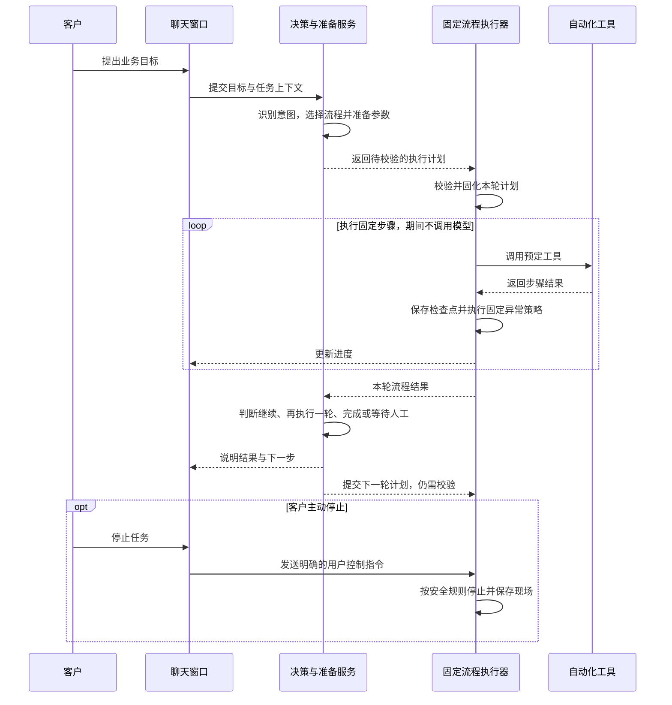
```mermaid
sequenceDiagram
    participant U as 客户
    participant UI as 聊天窗口
    participant M as 决策与准备服务
    participant E as 固定流程执行器
    participant T as 自动化工具

    U->>UI: 提出业务目标
    UI->>M: 提交目标与任务上下文
    M->>M: 识别意图，选择流程并准备参数
    M-->>E: 返回待校验的执行计划
    E->>E: 校验并固化本轮计划

    loop 执行固定步骤，期间不调用模型
        E->>T: 调用预定工具
        T-->>E: 返回步骤结果
        E->>E: 保存检查点并执行固定异常策略
        E-->>UI: 更新进度
    end

    E-->>M: 本轮流程结果
    M->>M: 判断继续、再执行一轮、完成或等待人工
    M-->>UI: 说明结果与下一步
    M-->>E: 提交下一轮计划，仍需校验

    opt 客户主动停止
        U->>UI: 停止任务
        UI->>E: 发送明确的用户控制指令
        E->>E: 按安全规则停止并保存现场
    end
```

用户控制指令与模型决策分开；运行期间的新业务要求保存为下一轮配置，不替换当前流程。

源码：[08-chat-execution-sequence.mmd](sources/08-chat-execution-sequence.mmd)

## 09．向量知识库与执行前话术准备

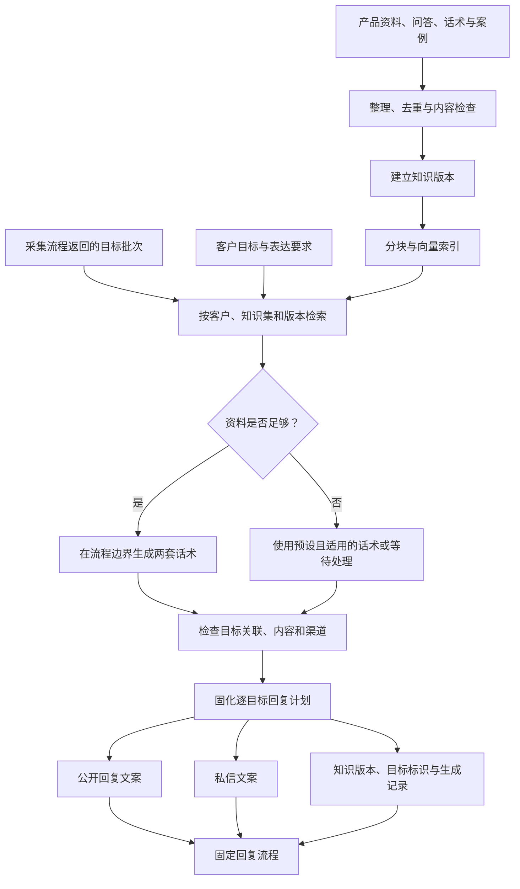
```mermaid
flowchart TB
    Source["产品资料、问答、话术与案例"]
    Clean["整理、去重与内容检查"]
    Version["建立知识版本"]
    Index["分块与向量索引"]

    Source --> Clean --> Version --> Index

    Targets["采集流程返回的目标批次"]
    Goal["客户目标与表达要求"]

    Targets --> Retrieve["按客户、知识集和版本检索"]
    Goal --> Retrieve
    Index --> Retrieve

    Retrieve --> Enough{"资料是否足够？"}
    Enough -->|是| Generate["在流程边界生成两套话术"]
    Enough -->|否| Fallback["使用预设且适用的话术或等待处理"]

    Generate --> Validate["检查目标关联、内容和渠道"]
    Fallback --> Validate

    Validate --> Plan["固化逐目标回复计划"]
    Plan --> Public["公开回复文案"]
    Plan --> Private["私信文案"]
    Plan --> Evidence["知识版本、目标标识与生成记录"]

    Public --> Execute["固定回复流程"]
    Private --> Execute
    Evidence --> Execute
```

进入回复流程后，执行器只读取已经准备好的文案，不再临时询问模型。

源码：[09-knowledge-talk-preparation.mmd](sources/09-knowledge-talk-preparation.mmd)

## 10．找视频固定流程

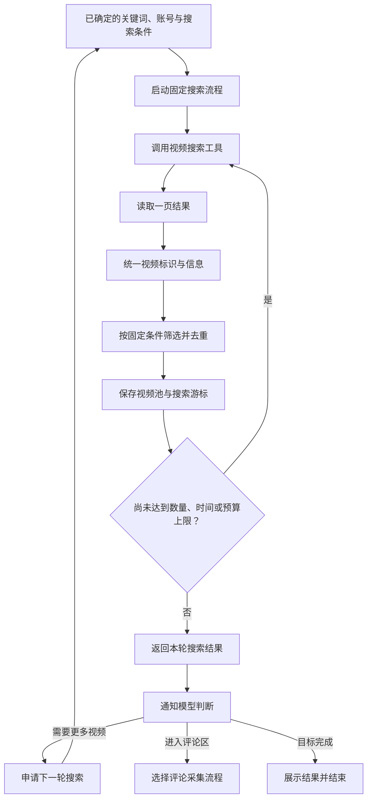
```mermaid
flowchart TD
    Input["已确定的关键词、账号与搜索条件"]
    Start["启动固定搜索流程"]
    Search["调用视频搜索工具"]
    Page["读取一页结果"]
    Normalize["统一视频标识与信息"]
    Filter["按固定条件筛选并去重"]
    Save["保存视频池与搜索游标"]

    Input --> Start --> Search --> Page --> Normalize --> Filter --> Save

    Save --> Continue{"尚未达到数量、时间或预算上限？"}
    Continue -->|是| Search
    Continue -->|否| Result["返回本轮搜索结果"]

    Result --> Judge["通知模型判断"]
    Judge -->|需要更多视频| Next["申请下一轮搜索"]
    Judge -->|进入评论区| Comments["选择评论采集流程"]
    Judge -->|目标完成| Done["展示结果并结束"]

    Next --> Input
```

搜索页之间的翻页、去重与保存由程序执行，不需要模型逐页指挥。

源码：[10-video-search-flow.mmd](sources/10-video-search-flow.mmd)

## 11．评论区完整业务架构

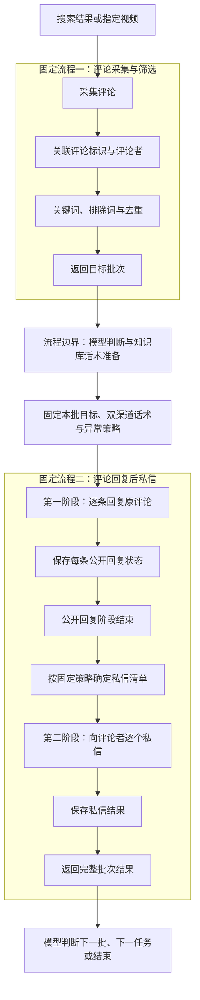
```mermaid
flowchart TB
    Videos["搜索结果或指定视频"]

    subgraph Collect["固定流程一：评论采集与筛选"]
        Read["采集评论"]
        Identify["关联评论标识与评论者"]
        Match["关键词、排除词与去重"]
        Batch["返回目标批次"]

        Read --> Identify --> Match --> Batch
    end

    Videos --> Read
    Batch --> Boundary["流程边界：模型判断与知识库话术准备"]
    Boundary --> Freeze["固定本批目标、双渠道话术与异常策略"]

    subgraph Reply["固定流程二：评论回复后私信"]
        Public["第一阶段：逐条回复原评论"]
        RecordPublic["保存每条公开回复状态"]
        Barrier["公开回复阶段结束"]
        Eligible["按固定策略确定私信清单"]
        Private["第二阶段：向评论者逐个私信"]
        RecordPrivate["保存私信结果"]
        Report["返回完整批次结果"]

        Public --> RecordPublic --> Barrier
        Barrier --> Eligible --> Private --> RecordPrivate --> Report
    end

    Freeze --> Public
    Report --> Judge["模型判断下一批、下一任务或结束"]
```

公开回复和私信分别记账；单个目标失败或结果未知时，按执行前固定的策略处理。

源码：[11-comment-area-business.mmd](sources/11-comment-area-business.mmd)

## 12．直播间完整业务架构

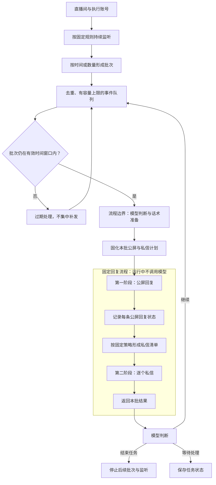
```mermaid
flowchart TB
    Room["直播间与执行账号"]
    Capture["按固定规则持续监听"]
    Slice["按时间或数量形成批次"]
    Queue["去重、有容量上限的事件队列"]

    Room --> Capture --> Slice --> Queue

    Queue --> Fresh{"批次仍在有效时间窗口内？"}
    Fresh -->|否| Expire["过期处理，不集中补发"]
    Fresh -->|是| Boundary["流程边界：模型判断与话术准备"]
    Boundary --> Freeze["固化本批公屏与私信计划"]

    subgraph Reply["固定回复流程：运行中不调用模型"]
        Public["第一阶段：公屏回复"]
        PublicState["记录每条公屏回复状态"]
        Targets["按固定策略形成私信清单"]
        Private["第二阶段：逐个私信"]
        Result["返回本批结果"]

        Public --> PublicState --> Targets --> Private --> Result
    end

    Freeze --> Public
    Result --> Judge["模型判断"]

    Judge -->|继续| Queue
    Judge -->|结束任务| Stop["停止后续批次与监听"]
    Judge -->|等待处理| Hold["保存任务状态"]

    Expire --> Queue
```

直播任务可以长期运行，但回复流程按小批次结束；监听与回复分别调度。

源码：[12-live-room-business.mmd](sources/12-live-room-business.mmd)

## 13．跨板块业务组合架构

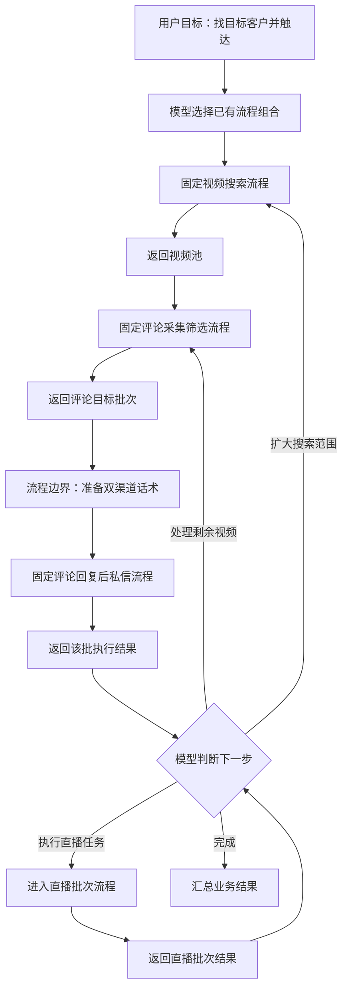
```mermaid
flowchart TB
    Goal["用户目标：找目标客户并触达"]
    Decision["模型选择已有流程组合"]

    Goal --> Decision

    Decision --> Search["固定视频搜索流程"]
    Search --> Videos["返回视频池"]
    Videos --> Collect["固定评论采集筛选流程"]
    Collect --> Targets["返回评论目标批次"]

    Targets --> Prepare["流程边界：准备双渠道话术"]
    Prepare --> Reply["固定评论回复后私信流程"]
    Reply --> Result["返回该批执行结果"]

    Result --> Judge{"模型判断下一步"}
    Judge -->|处理剩余视频| Collect
    Judge -->|扩大搜索范围| Search
    Judge -->|执行直播任务| Live["进入直播批次流程"]
    Judge -->|完成| Done["汇总业务结果"]

    Live --> LiveResult["返回直播批次结果"]
    LiveResult --> Judge
```

再次运行使用检查点和去重记录，不把已完成的目标重新触达一遍。

源码：[13-cross-module-composition.mmd](sources/13-cross-module-composition.mmd)

## 14．多账号并行执行架构

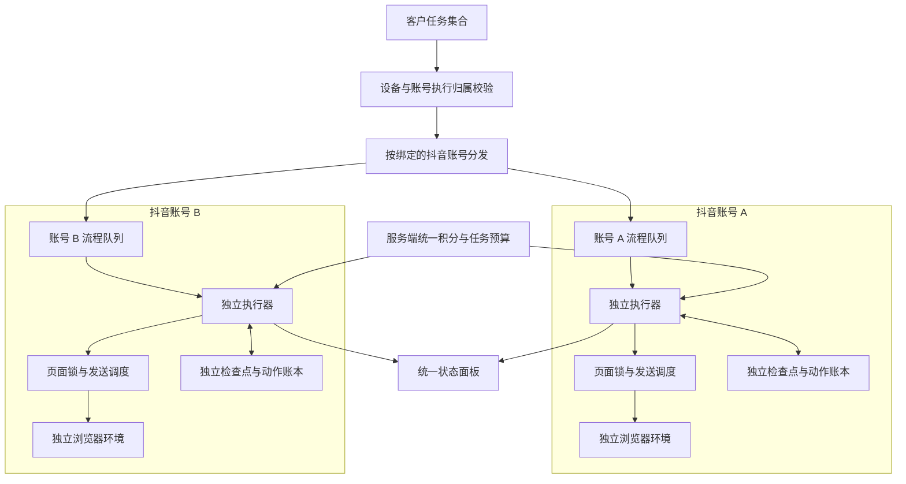
```mermaid
flowchart TB
    Tasks["客户任务集合"]
    Router["按绑定的抖音账号分发"]
    Ownership["设备与账号执行归属校验"]

    Tasks --> Ownership --> Router

    subgraph A["抖音账号 A"]
        QA["账号 A 流程队列"]
        EA["独立执行器"]
        LA["页面锁与发送调度"]
        BA["独立浏览器环境"]
        DA["独立检查点与动作账本"]

        QA --> EA --> LA --> BA
        EA <--> DA
    end

    subgraph B["抖音账号 B"]
        QB["账号 B 流程队列"]
        EB["独立执行器"]
        LB["页面锁与发送调度"]
        BB["独立浏览器环境"]
        DB["独立检查点与动作账本"]

        QB --> EB --> LB --> BB
        EB <--> DB
    end

    Router --> QA
    Router --> QB

    Budget["服务端统一积分与任务预算"] --> EA
    Budget --> EB

    EA --> View["统一状态面板"]
    EB --> View
```

不同账号并行；同一账号的页面操作和发送有明确锁与调度。切换面板正在查看的账号，不改变后台任务绑定的账号。

源码：[14-multi-account-parallel.mmd](sources/14-multi-account-parallel.mmd)

## 15．单轮固定流程的生命周期

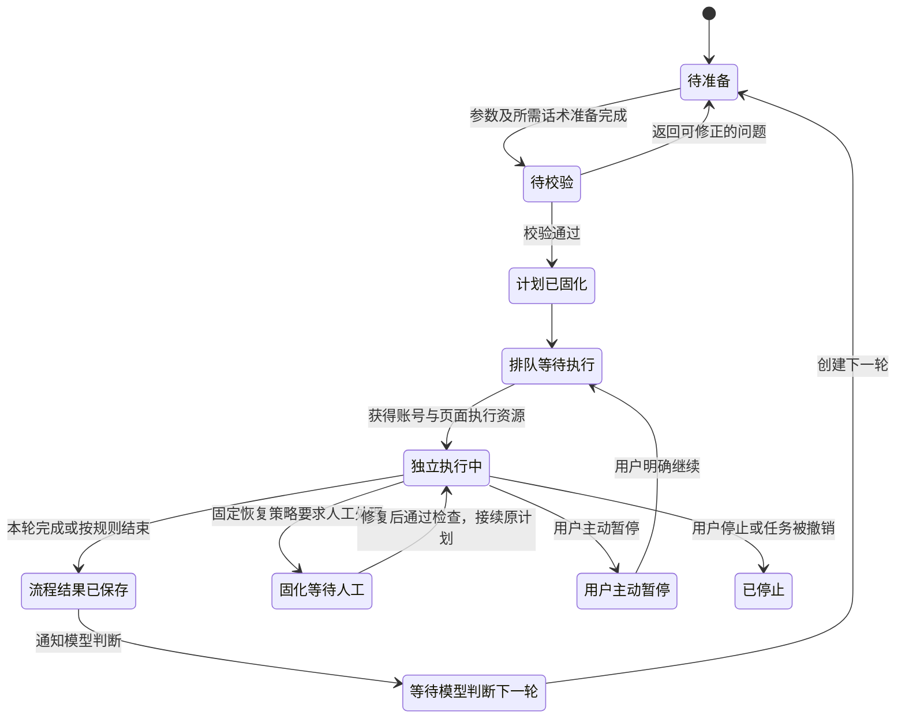
```mermaid
stateDiagram-v2
    state "待准备" as Preparing
    state "待校验" as Validating
    state "计划已固化" as Sealed
    state "排队等待执行" as Queued
    state "独立执行中" as Running
    state "流程结果已保存" as Reported
    state "等待模型判断下一轮" as Decision
    state "固化等待人工" as Human
    state "用户主动暂停" as Paused
    state "已停止" as Stopped

    [*] --> Preparing
    Preparing --> Validating: 参数及所需话术准备完成
    Validating --> Preparing: 返回可修正的问题
    Validating --> Sealed: 校验通过
    Sealed --> Queued
    Queued --> Running: 获得账号与页面执行资源

    Running --> Reported: 本轮完成或按规则结束
    Reported --> Decision: 通知模型判断
    Decision --> Preparing: 创建下一轮

    Running --> Human: 固定恢复策略要求人工处理
    Human --> Running: 修复后通过检查，接续原计划

    Running --> Paused: 用户主动暂停
    Paused --> Queued: 用户明确继续

    Running --> Stopped: 用户停止或任务被撤销
```

模型不能把正在运行或等待人工恢复的实例替换成另一个冲突实例。

源码：[15-run-lifecycle.mmd](sources/15-run-lifecycle.mmd)

## 16．异常重试、固化与人工后自动恢复

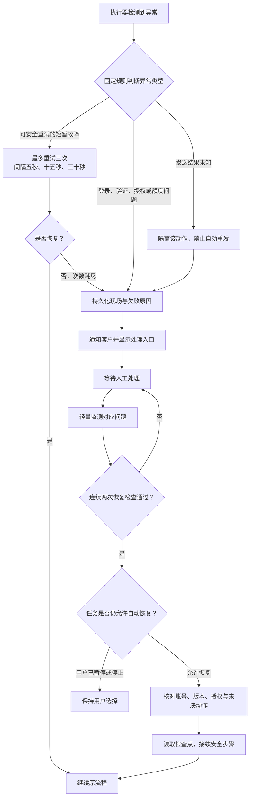
```mermaid
flowchart TD
    Error["执行器检测到异常"]
    Classify{"固定规则判断异常类型"}

    Error --> Classify

    Classify -->|可安全重试的短暂故障| Retry["最多重试三次<br/>间隔五秒、十五秒、三十秒"]
    Retry --> Success{"是否恢复？"}
    Success -->|是| Continue["继续原流程"]
    Success -->|否，次数耗尽| Save["持久化现场与失败原因"]

    Classify -->|登录、验证、授权或额度问题| Save
    Classify -->|发送结果未知| Unknown["隔离该动作，禁止自动重发"]
    Unknown --> Save

    Save --> Notify["通知客户并显示处理入口"]
    Notify --> Waiting["等待人工处理"]
    Waiting --> Detect["轻量监测对应问题"]

    Detect --> Check{"连续两次恢复检查通过？"}
    Check -->|否| Waiting
    Check -->|是| State{"任务是否仍允许自动恢复？"}

    State -->|用户已暂停或停止| Keep["保持用户选择"]
    State -->|允许恢复| Restore["核对账号、版本、授权与未决动作"]
    Restore --> Resume["读取检查点，接续安全步骤"]
    Resume --> Continue
```

恢复的是原流程和原进度，不是重新创建任务；未知发送动作保持隔离，不能随着流程恢复被再次执行。

源码：[16-retry-recovery.mmd](sources/16-retry-recovery.mmd)

## 17．双渠道动作账本与防重复发送

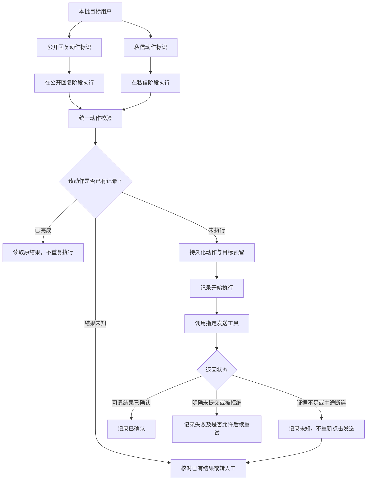
```mermaid
flowchart TB
    Target["本批目标用户"]
    PublicID["公开回复动作标识"]
    PrivateID["私信动作标识"]

    Target --> PublicID
    Target --> PrivateID

    PublicID --> PublicPhase["在公开回复阶段执行"]
    PrivateID --> PrivatePhase["在私信阶段执行"]

    PublicPhase --> Gate["统一动作校验"]
    PrivatePhase --> Gate

    Gate --> Existing{"该动作是否已有记录？"}
    Existing -->|已完成| Skip["读取原结果，不重复执行"]
    Existing -->|结果未知| Verify["核对已有结果或转人工"]
    Existing -->|未执行| Reserve["持久化动作与目标预留"]

    Reserve --> Start["记录开始执行"]
    Start --> Tool["调用指定发送工具"]
    Tool --> Result{"返回状态"}

    Result -->|可靠结果已确认| Confirmed["记录已确认"]
    Result -->|明确未提交或被拒绝| Failed["记录失败及是否允许后续重试"]
    Result -->|证据不足或中途断连| Unknown["记录未知，不重新点击发送"]

    Unknown --> Verify
```

公开回复和私信是两个不同动作；重复运行流程不能重复执行其中已经完成的动作。

源码：[17-action-ledger-idempotency.mmd](sources/17-action-ledger-idempotency.mmd)

## 18．平台与协作者的开发边界

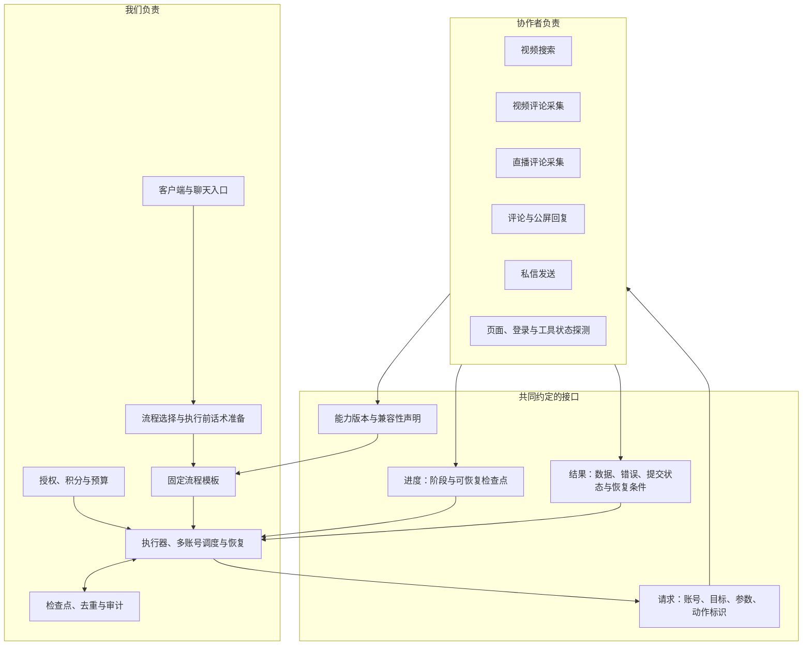
```mermaid
flowchart TB
    subgraph Platform["我们负责"]
        UI["客户端与聊天入口"]
        Auth["授权、积分与预算"]
        Decision["流程选择与执行前话术准备"]
        Templates["固定流程模板"]
        Engine["执行器、多账号调度与恢复"]
        Ledger["检查点、去重与审计"]
    end

    subgraph Interface["共同约定的接口"]
        Request["请求：账号、目标、参数、动作标识"]
        Progress["进度：阶段与可恢复检查点"]
        Response["结果：数据、错误、提交状态与恢复条件"]
        Version["能力版本与兼容性声明"]
    end

    subgraph Collaborator["协作者负责"]
        Search["视频搜索"]
        Comments["视频评论采集"]
        Live["直播评论采集"]
        Public["评论与公屏回复"]
        Private["私信发送"]
        Probe["页面、登录与工具状态探测"]
    end

    UI --> Decision
    Decision --> Templates
    Auth --> Engine
    Templates --> Engine
    Engine <--> Ledger

    Engine --> Request
    Request --> Collaborator

    Collaborator --> Progress
    Collaborator --> Response
    Collaborator --> Version

    Progress --> Engine
    Response --> Engine
    Version --> Templates
```

协作者提供工具能力和执行事实；平台决定授权、费用、固定流程、调度和恢复。

源码：[18-platform-collaborator-boundary.mmd](sources/18-platform-collaborator-boundary.mmd)

## 19．核心数据与状态归属

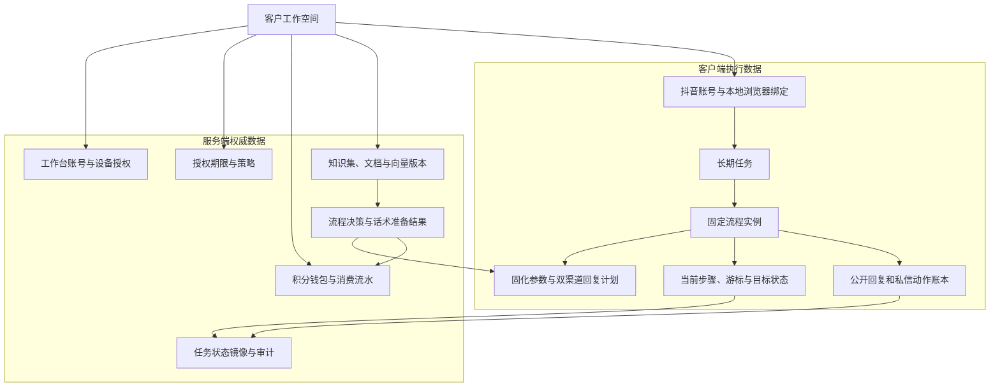
```mermaid
flowchart TB
    Workspace["客户工作空间"]

    subgraph Server["服务端权威数据"]
        User["工作台账号与设备授权"]
        License["授权期限与策略"]
        Wallet["积分钱包与消费流水"]
        Knowledge["知识集、文档与向量版本"]
        Plans["流程决策与话术准备结果"]
        Mirror["任务状态镜像与审计"]
    end

    subgraph Local["客户端执行数据"]
        Account["抖音账号与本地浏览器绑定"]
        Task["长期任务"]
        Run["固定流程实例"]
        Frozen["固化参数与双渠道回复计划"]
        Checkpoint["当前步骤、游标与目标状态"]
        Action["公开回复和私信动作账本"]
    end

    Workspace --> User
    Workspace --> License
    Workspace --> Wallet
    Workspace --> Knowledge
    Workspace --> Account

    Account --> Task
    Task --> Run
    Plans --> Frozen
    Run --> Frozen
    Run --> Checkpoint
    Run --> Action

    Knowledge --> Plans
    Plans --> Wallet
    Checkpoint --> Mirror
    Action --> Mirror
```

检查点保存进度，不把旧余额或旧授权当作恢复后的有效事实；恢复时重新向服务端确认。

源码：[19-data-state-ownership.mmd](sources/19-data-state-ownership.mmd)

## 20．部署、分发与升级架构

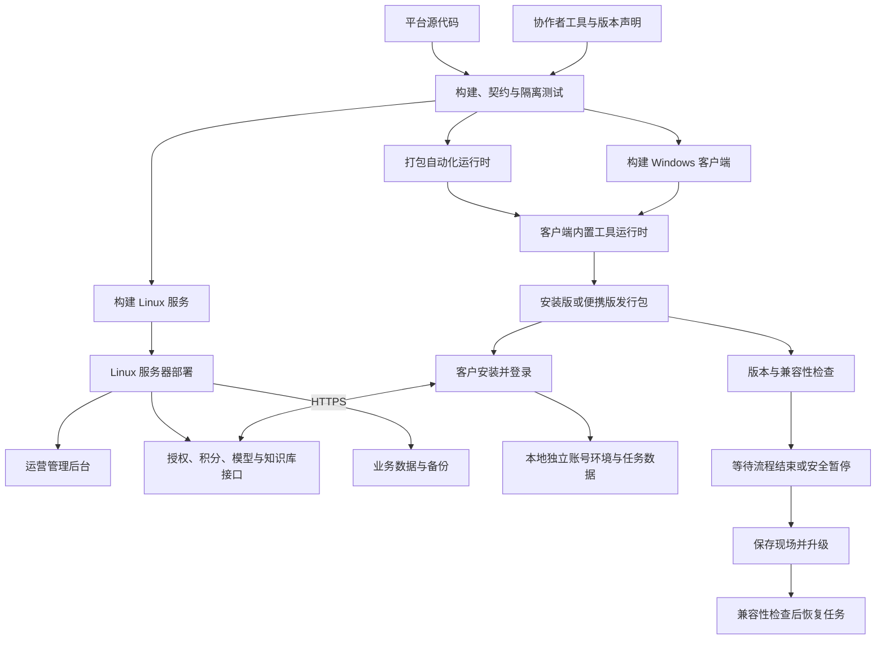
```mermaid
flowchart TB
    PlatformCode["平台源代码"]
    ToolCode["协作者工具与版本声明"]

    PlatformCode --> Checks["构建、契约与隔离测试"]
    ToolCode --> Checks

    Checks --> ServerBuild["构建 Linux 服务"]
    Checks --> ClientBuild["构建 Windows 客户端"]
    Checks --> ToolBuild["打包自动化运行时"]

    ServerBuild --> Linux["Linux 服务器部署"]
    Linux --> Admin["运营管理后台"]
    Linux --> API["授权、积分、模型与知识库接口"]
    Linux --> Data["业务数据与备份"]

    ToolBuild --> Bundle["客户端内置工具运行时"]
    ClientBuild --> Bundle
    Bundle --> Release["安装版或便携版发行包"]

    Release --> Customer["客户安装并登录"]
    Customer --> Local["本地独立账号环境与任务数据"]
    Customer <-->|HTTPS| API

    Release --> Update["版本与兼容性检查"]
    Update --> Boundary["等待流程结束或安全暂停"]
    Boundary --> Upgrade["保存现场并升级"]
    Upgrade --> Recover["兼容性检查后恢复任务"]
```

自动化执行发生在客户运行中的 Windows 客户端。关闭客户端后保存现场；重新启动后，依据检查点、授权和动作状态接续。

源码：[20-deployment-upgrade.mmd](sources/20-deployment-upgrade.mmd)
